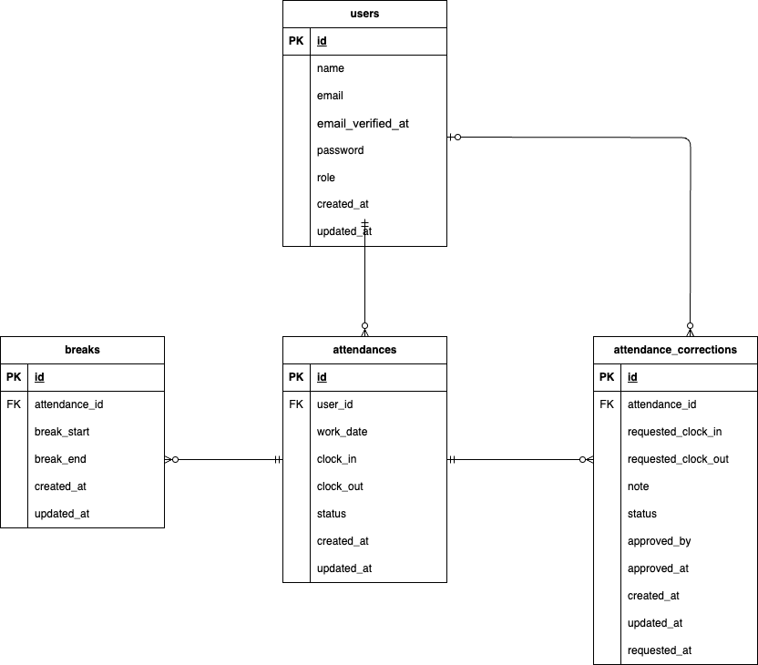

# アプリ名：　attendance-app


##　　環境構築

##　Dockerビルド
```bash
　　・git clone git@github.com:aokiaiko/attendance-app.git
　　・docker-compose up -d --build
```

##　laravel環境構築
```bash
   ・docker-compose exec php bash
   ・composer install
   ・cp .env.example .env　　環境変数を変更
   ・php artisan key:generate
   ・php artisan migrate
   ・php artisan db:seed
```

##　　開発環境
   ・アプリ: http://localhost/
   ・ユーザー登録: http://localhost/register
   ・phpMyAdmin: http://localhost:8080/
   ・MailHog: http://localhost:8025

##　　使用技術
   ・PHP 8.1
   ・Laravel 8.83.8
   ・MySQL 8.0
   ・nginx 1.21.1

##　　ER図
    

